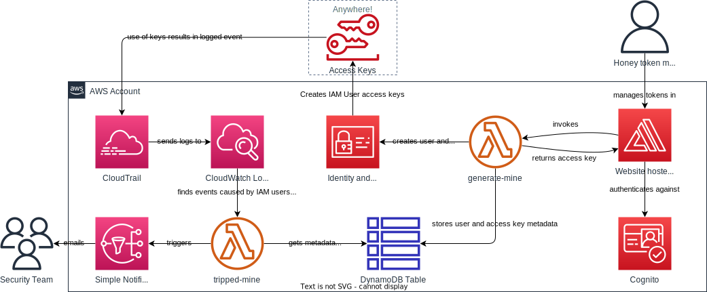

# aws-mine

A honey token system for AWS

## Purpose

Create AWS access keys that can be placed in various places to tempt bad guys. If used, you will be notified within ~4 minutes. You can then investigate that asset to determine if it may have been compromised.

## Architecture

## Deployment

### Deploy via AWS Amplify

This application is built using AWS Amplify, a fully-managed web hosting service.

1. Clone the repository.
2. Create a dedicated AWS account for honey tokens. Even though this project doesn't interact with other services or grant any access to the account, it is still best practice to keep it isolated from anything else.
3. In the dedicated account, [create a new AWS Amplify app](https://console.aws.amazon.com/amplify/create/add-repo) and direct it to your git repository.
4. AWS Amplify will deploy the application and return the URL where you can access it.

### Configure a notification subscription

`aws-mine` creates an Amazon SNS topic where messages are published if access keys are used. [Create a subscription](https://docs.aws.amazon.com/sns/latest/dg/sns-create-subscribe-endpoint-to-topic.html) to this topic with an email address where you would like to receive notifications.

### Configure user access

By default the application manages users in an Amazon Cognito user pool, and [requires TOTP MFA](https://docs.amplify.aws/react/build-a-backend/auth/concepts/multi-factor-authentication/#configure-multi-factor-authentication). Add new users in the Cognito console, self sign-up is disabled.

You can configure single sign-on via SAML, for example with AWS IAM Identity Center, using the [AWS Amplify instructions](https://docs.amplify.aws/react/build-a-backend/auth/concepts/external-identity-providers/#configure-saml-provider).

## Usage

In the aws-mine console, create 'mines' (a pair of keys including the key id and secret access key). Make sure to provide a helpful description of where they will be placed. If you receive notification that they have been used, you will want to know where they were placed originally so you can determine if that asset has been compromised.

Copy and paste pairs of AWS access keys anywhere you want to tempt bad guys and detect if someone tries to use them. These are normally placed into an AWS credentials file at `~/.aws/credentials` on macOS and Linux, or `%USERPROFILE%.aws\credentials` on Windows.

## Similar projects

- [spacesiren](https://github.com/spacesiren/spacesiren)
- [canarytokens](https://docs.canarytokens.org/guide/aws-keys-token.html)
- [IMDSpoof](https://github.com/grahamhelton/IMDSpoof)

## License

This project is licensed under the MIT-0 License. See the LICENSE file.
